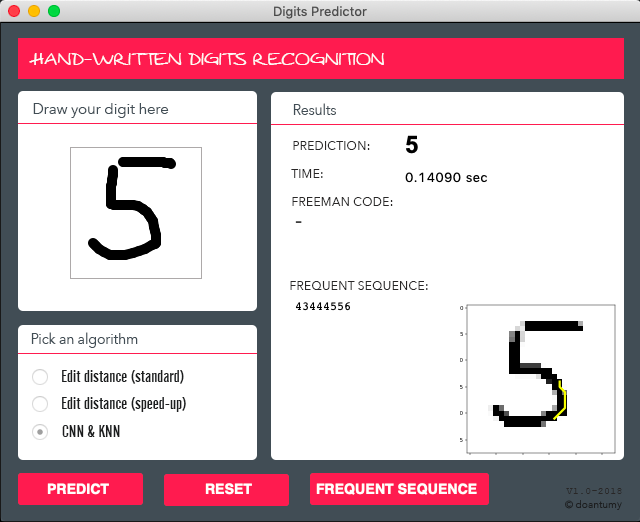

# Introduction
The first main objective of this project is to implement different classification algorithms like KNN, CNN and several techniques in order to improve the speed and the quality of the algorithms for the MNIST dataset. For the second task, we have to apply data mining algorithms in order to mine frequent sequence on the dataset and show it on the test digits.

 

# Installation
Due to the limit of file size for email attachment, we uploaded the following files onto Google Drive at the links below:

1. CNN model
https://drive.google.com/open?id=1D8xmOBFSC3u-jAAm3bIHQn9HW2RSRPvl
After downloading and extracting the file, please put it into folder ./model/

2. Condensed dataset
https://drive.google.com/open?id=1CC4Ldd0GmEe9k9Hp4AbIsNTQR1JGH0Cy
After downloading and extracting the file, please put it into folder ./data/

3. Distance matrix
https://drive.google.com/open?id=1ey-xERIA5fNUs7a0MkstLkZ8eRh2r1-Y
After downloading and extracting the file, please put it into folder ./data/
